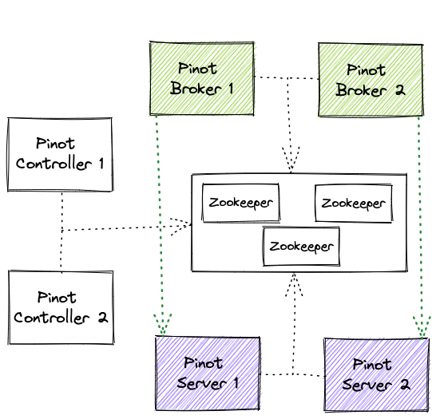
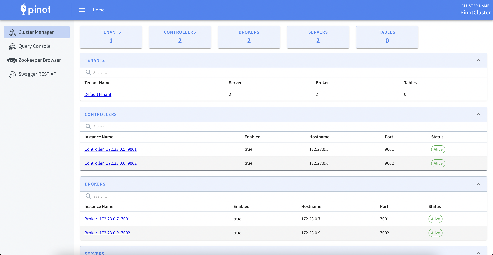
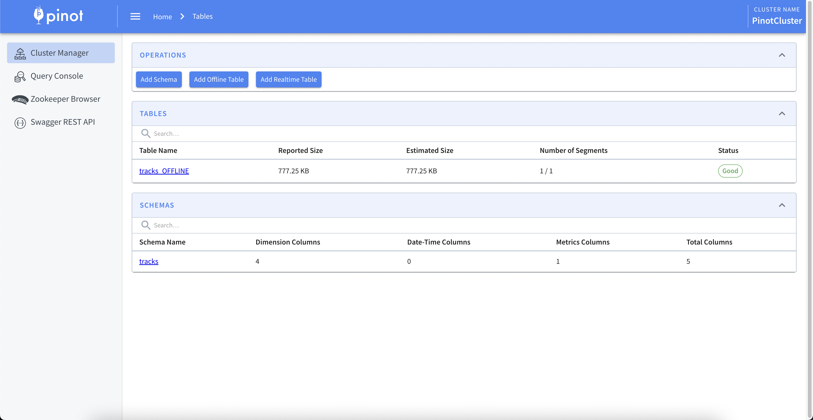
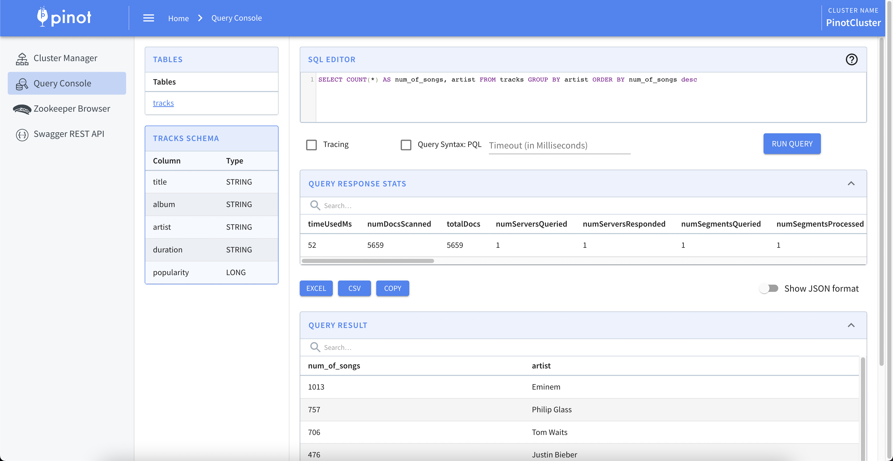

<div style="text-align: justify;">
<p>
As data is growing and businesses require rapid data analysis to make their decisions, a need emerged for systems that can support real-time analytics on streams of data with low latency. This article will show you how to spin up an Apache Pinot cluster in a simple way using <b>Docker</b> and <b>docker-compose</b>.
</p>

<p>
<a href="https://pinot.apache.org/" target="_blank">Apache Pinot</a> is a real-time distributed OLAP datastore, built to deliver scalable real-time analytics with low latency on large datasets. It can ingest from batch data sources (such as Hadoop HDFS, Amazon S3, Azure ADLS, Google Cloud Storage) as well as stream data sources (such as Apache Kafka). Pinot is not only used to support complex analytics use cases, but also for anomaly detection and ad-hoc data exploration.
</p>

<p>
Pinot was built by engineers at LinkedIn and Uber and is using a columnar store, with several smart indexing and pre-aggregation techniques for low latency. Pinot also supports geospatial data analysis with the usage of <a href="https://eng.uber.com/h3/" target="_blank">Uber's H3 geoindexing</a>. These features make Pinot a great choice for user-facing realtime analytics. 
</p>

<p>
Pinot supports various integrations with other systems, some of which include <a href="https://trino.io" target="_blank">Trino</a> distributed query engine to support joins with other data sources, as well as <a href="https://superset.apache.org/" target="_blank">Apache Superset</a> for interactive dashboards.
</p>

<p>
Apache Pinot is availabe as a managed service from <a href="https://startree.ai/" target="_blank">StarTree</a> Cloud.
</p>
</div>

## Pinot's basic components

Apache Pinot's basic components of Apache Pinot include the following:

### Cluster

A **Cluster** is a set of nodes comprising of servers, brokers, controllers and minions.

<div style="text-align: justify;">
<p>
Pinot uses <a href="https://helix.apache.org/" target="_blank">Apache Helix</a> for cluster management. Helix is a cluster management framework that manages replicated, partitioned resources in a distributed system. Helix uses Zookeeper to store cluster state and metadata.
</p>
</div>

### Controller

<div style="text-align: justify;">
<p> 
The Pinot <b>Controller</b> is responsible for maintaining global metadata (e.g. configs and schemas) of the system with the help of Zookeeper which is used as the persistent metadata store. It hosts <a href="https://helix.apache.org/" target="_blank">Apache Helix</a> controller to manage all Pinot components, and, among other features, it maintainins the mapping of which servers are responsible for which segments. This mapping is used by the servers to download the portion of the segments that they are responsible for. This mapping is also used by the broker to decide which servers to route the queries to.
</p>
</div>

### Broker


<div style="text-align: justify;">
<p> 
Pinot <b>Brokers</b> accept queries from clients and forwards the request to the appropriate servers. They gather all the responses from the servers and they unify them in a single response to the clients.
</p>
</div>

### Server

<div style="text-align: justify;">
<p> 
Pinot <b>Servers</b> host the data segments and serve queries off the data they host. There are two types of servers, the <u>offline</u> and the <u>real-time</u> servers, to support both batch and real-time operations
</p>
</div>

### Minion

<div style="text-align: justify;">
<p>
Minion uses the <a href="https://engineering.linkedin.com/blog/2019/01/managing-distributed-tasks-with-helix-task-framework" target="_blank">Apache Helix Task Framework</a> to offload computationally intensive tasks from other components. 
</p> 
</div>

### Tenant

<div style="text-align: justify;">
<p>
In order to support multi-tenancy among Pinot servers, Pinot has be configured class support for tenants. A table is associated with a tenant, which allows all tables belonging to a particular logical namespace to be grouped under a single tenant name and isolated from other tenants. This isolation between tenants provides different namespaces for applications and teams to prevent sharing tables or schemas. 
</p>
</div>

{: .mx-auto.d-block :}
<p align = "center">
Fig. 1: Apache Pinot Architecture
</p>

## Setup a cluster using Docker

To keep things simple, the current setup utilizes only the default tenant of Pinot, so, both Pinot servers belong to the `DefaultTenant`.

A cluster called `PinotCluster` (v0.10.0) will be created with the following components:

- 3 Zookeeper instances (ensemble)
- 2 Pinot Controllers
- 2 Pinot Brokers
- 2 Pinot Servers

It is important to keep this component starting sequence in order to form the cluster safely, thus, healthchecks have been configured to achieve this in Docker. In addition, Docker volumes are used to persist all data of the cluster.

---
```yml
# docker-compose.yml file
version: '3'

services:
  zookeeper-1:
    image: zookeeper:latest
    hostname: zookeeper-1
    restart: "unless-stopped"
    ports:
      - "2181:2181"
    environment:
      ZOO_MY_ID: 1
      ZOO_PORT: 2181
      ZOO_SERVERS: server.1=zookeeper-1:2888:3888;2181 server.2=zookeeper-2:2888:3888;2181 server.3=zookeeper-3:2888:3888;2181 
    volumes:
      - zkData1:/data
      - zkCatalog1:/catalog
    healthcheck:
      test: nc -z localhost 2181 || exit 1
      interval: 10s
      timeout: 10s
      retries: 10

  zookeeper-2:
    image: zookeeper:latest
    restart: "unless-stopped"
    hostname: zookeeper-2
    ports:
      - "2182:2181"
    environment:
      ZOO_MY_ID: 2
      ZOO_PORT: 2181
      ZOO_SERVERS: server.1=zookeeper-1:2888:3888;2181 server.2=zookeeper-2:2888:3888;2181 server.3=zookeeper-3:2888:3888;2181 
    volumes:
      - zkData2:/data
      - zkCatalog2:/catalog
    healthcheck:
      test: nc -z localhost 2181 || exit 1
      interval: 10s
      timeout: 10s
      retries: 10

  zookeeper-3:
    image: zookeeper:latest
    restart: "unless-stopped"
    hostname: zookeeper-3
    ports:
      - "2183:2181"
    environment:
      ZOO_MY_ID: 3
      ZOO_PORT: 2181
      ZOO_SERVERS: server.1=zookeeper-1:2888:3888;2181 server.2=zookeeper-2:2888:3888;2181 server.3=zookeeper-3:2888:3888;2181 
    volumes:
      - zkData3:/data
      - zkCatalog3:/catalog
    healthcheck:
      test: nc -z localhost 2181 || exit 1
      interval: 10s
      timeout: 10s
      retries: 10

  controller-1:
    image: apachepinot/pinot:0.10.0
    restart: "unless-stopped"
    hostname: controller-1
    volumes:
      - pinotController1:/tmp/data/controller
    ports:
      - "9001:9001"
    command: StartController -zkAddress zookeeper-1:2181,zookeeper-2:2182,zookeeper-3:2183 -clusterName PinotCluster -controllerPort 9001
    depends_on:
      zookeeper-1:
        condition: service_healthy
      zookeeper-2:
        condition: service_healthy
      zookeeper-3:
        condition: service_healthy
    healthcheck:
      test: curl --fail -s http://controller-1:9001/ || exit 1
      interval: 1m30s
      timeout: 10s
      retries: 5

  controller-2:
    image: apachepinot/pinot:0.10.0
    restart: "unless-stopped"
    hostname: controller-2
    volumes:
      - pinotController2:/tmp/data/controller
    ports:
      - "9002:9002"
    command: StartController -zkAddress zookeeper-1:2181,zookeeper-2:2182,zookeeper-3:2183 -clusterName PinotCluster -controllerPort 9002
    depends_on:
      zookeeper-1:
        condition: service_healthy
      zookeeper-2:
        condition: service_healthy
      zookeeper-3:
        condition: service_healthy
      controller-1:
        condition: service_healthy
    healthcheck:
      test: curl --fail -s http://controller-2:9002/ || exit 1
      interval: 1m30s
      timeout: 10s
      retries: 5

  broker-1:
    image: apachepinot/pinot:0.10.0
    restart: "unless-stopped"
    hostname: broker-1
    ports:
      - "7001:7001"
    command: StartBroker -zkAddress zookeeper-1:2181,zookeeper-2:2182,zookeeper-3:2183 -clusterName PinotCluster -brokerPort 7001
    depends_on:
      zookeeper-1:
        condition: service_healthy
      zookeeper-2:
        condition: service_healthy
      zookeeper-3:
        condition: service_healthy
      controller-1:
        condition: service_healthy
      controller-2:
        condition: service_healthy

  broker-2:
    image: apachepinot/pinot:0.10.0
    restart: "unless-stopped"
    hostname: broker-2
    ports:
      - "7002:7002"
    command: StartBroker -zkAddress zookeeper-1:2181,zookeeper-2:2182,zookeeper-3:2183 -clusterName PinotCluster -brokerPort 7002
    depends_on:
      zookeeper-1:
        condition: service_healthy
      zookeeper-2:
        condition: service_healthy
      zookeeper-3:
        condition: service_healthy
      controller-1:
        condition: service_healthy
      controller-2:
        condition: service_healthy

  server-1:
    image: apachepinot/pinot:0.10.0
    restart: "unless-stopped"
    hostname: server-1
    volumes:
      - pinotServer1:/tmp/data/server
    ports:
      - "8001:8001"
      - "8011:8011"
    command: StartServer -zkAddress zookeeper-1:2181,zookeeper-2:2182,zookeeper-3:2183 -clusterName PinotCluster -serverPort 8001 -serverAdminPort 8011
    depends_on:
      zookeeper-1:
        condition: service_healthy
      zookeeper-2:
        condition: service_healthy
      zookeeper-3:
        condition: service_healthy
      controller-1:
        condition: service_healthy
      controller-2:
        condition: service_healthy

  server-2:
    image: apachepinot/pinot:0.10.0
    restart: "unless-stopped"
    hostname: server-2
    volumes:
      - pinotServer2:/tmp/data/server
    ports:
      - "8002:8002"
      - "8012:8012"
    command: StartServer -zkAddress zookeeper-1:2181,zookeeper-2:2182,zookeeper-3:2183 -clusterName PinotCluster -serverPort 8002 -serverAdminPort 8012
    depends_on:
      zookeeper-1:
        condition: service_healthy
      zookeeper-2:
        condition: service_healthy
      zookeeper-3:
        condition: service_healthy
      controller-1:
        condition: service_healthy
      controller-2:
        condition: service_healthy

volumes:
  zkData1:
  zkData2:
  zkData3:
  zkCatalog1:
  zkCatalog2:
  zkCatalog3:
  pinotController1:
  pinotController2:
  pinotServer1:
  pinotServer2:
```

To start all services above run: 
```bash
docker-compose up -d
```

Navigate to <a href="http://localhost:9001" target="_blank">localhost:9001</a> to check the Pinot cluster, its components and the query console. The memory consumption just to spin up the services is approximately 6GB and the time for all services to start is about 5-10 minutes (depending on the machine). It is highly recommended to use multiple machines to host the several containers of the cluster, as this setup is memory exhaustive to host in a single machine.

{: .mx-auto.d-block :}
<p align = "center">
Fig. 2: Apache Pinot user interface
</p>

## Ingest & query sample data in Apache Pinot

In order to test the cluster of Pinot, a simple CSV ingestion job will be executed using the following commands. 

The CSV file to be ingested is a small tracks dataset. To speed up the ingestion, `tracks` schema file and table definition have been created. All associated files can be found in my GitHub [repository](https://github.com/cnatsis/pinot-cluster-docker).

```bash
# Create temp folders in the container
docker exec pinot-controller-1-1 mkdir -p /tmp/raw_data/tracks
docker exec pinot-controller-1-1 mkdir -p /tmp/definitions/

# Copy files to container
docker cp tracks.csv pinot-controller-1-1:/tmp/raw_data/tracks/
docker cp tracks-schema.json pinot-controller-1-1:/tmp/definitions/
docker cp tracks-table-offline.json pinot-controller-1-1:/tmp/definitions/
docker cp tracks_job_spec.yml pinot-controller-1-1:/tmp/definitions/

# Add schema and table
docker exec -it pinot-controller-1-1 \
    /opt/pinot/bin/pinot-admin.sh AddTable \
    -controllerPort 9001 \
    -schemaFile /tmp/definitions/tracks-schema.json \
    -tableConfigFile /tmp/definitions/tracks-table-offline.json \
    -exec

# Ingest CSV data
docker exec -it pinot-controller-1-1 \
    /opt/pinot/bin/pinot-admin.sh LaunchDataIngestionJob \
    -jobSpecFile /tmp/definitions/tracks_job_spec.yml
```

Once the ingestion is completed, the table will be shown in the `Cluster Manager` view and can be queried using Pinot's `Query Console`. 

{: .mx-auto.d-block :}
<p align = "center">
Fig. 3: Apache Pinot tables
</p>

A sample query to execute is:

```sql
SELECT 
  COUNT(*) AS num_of_songs, artist 
FROM 
  tracks 
GROUP BY 
  artist 
ORDER BY 
  num_of_songs desc
```

{: .mx-auto.d-block :}
<p align = "center">
Fig. 4: Apache Pinot Query Console
</p>

## References

- [Apache Pinot Documentation](https://docs.pinot.apache.org/)
- [StarTree](https://www.startree.ai/)

